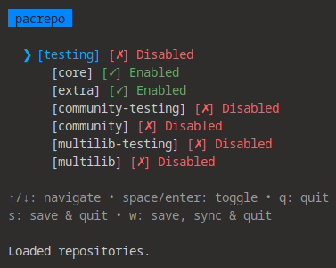

# pacrepo

A small TUI for toggling pacman repositories on Arch btw



## Features

- View all configured pacman repositories
- Toggle repositories on/off with a keypress
- Automatic database sync after changes (`pacman -Sy`)
- Sudo permission checking

## Usage

```bash
sudo pacrepo
```

## Building

1. Ensure you have Go 1.16+ installed and clone this repository:
   ```bash
   git clone git@github.com:zewebdev1337/pacrepo.git
   cd pacrepo
   ```
2. Build and install:
   ```bash
   go build -o pacrepo cmd/main.go
   sudo mv pacrepo /usr/local/bin/
   ```

## Known Limitations
- Only modifies repository sections ([options] and other sections are out of scope)
- Skips known example/placeholder repository names

## License

This project is released under the MIT License. Check the [LICENSE](LICENSE) file for details.
